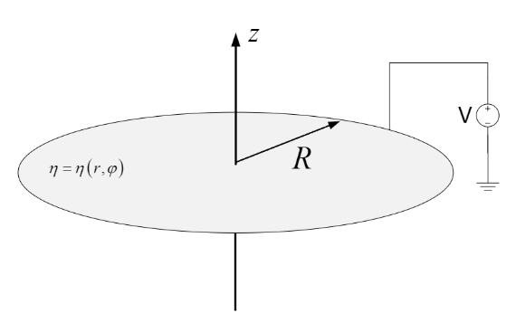
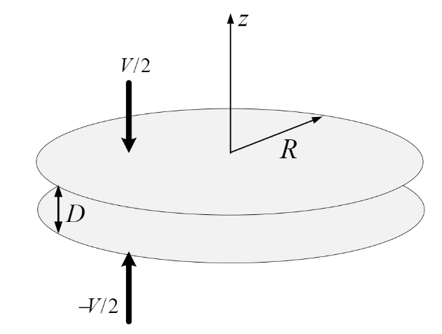

# Electromagnetic Fields Project

This project contains MATLAB code and supporting documents dealing with electromagnetic fields, specifically focusing on two problems: calculating the charge on a disk and determining the capacity of a circular capacitor.

## Project Overview

### Part 1: Charge on a Disk
- **Objective**: Calculate the charge on a disk both mathematically and analytically using discretization methods.
- **Files**:
  - `Q1.m`: MATLAB script for the charge on a disk calculation.
  - `1B figure.fig`: MATLAB figure file related to the charge on a disk.

### Part 2: Circular Capacitor
- **Objective**: Calculate the capacity of a circular capacitor based on the distance between plates using both mathematical and discretization methods.
- **Files**:
  - `Q2.m`: MATLAB script for the circular capacitor capacity calculation.
  - `2C figure.fig`: MATLAB figure file related to the circular capacitor.

### Supporting Documents
- `EMF_Project_definition.pdf`: PDF document outlining the project definition.
- `Project_results.pdf`: PDF document containing detailed results and all mathematical calculations for both parts of the project.

## Results

The detailed results and mathematical calculations for both parts of the project are documented in the `Project_results.pdf` file. This document includes:
- Mathematical derivations for the charge on a disk and the capacity of a circular capacitor.
- Numerical results obtained from the MATLAB scripts.
- Visualizations and figures related to the calculations.
